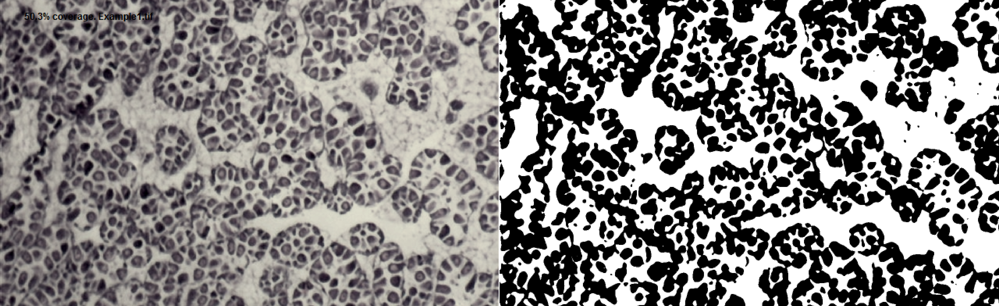
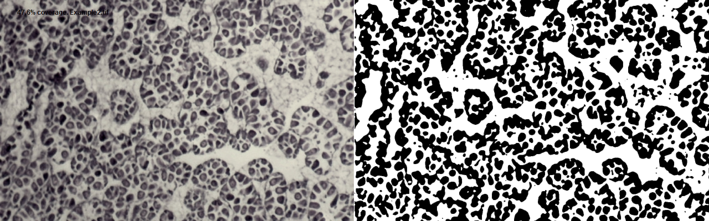
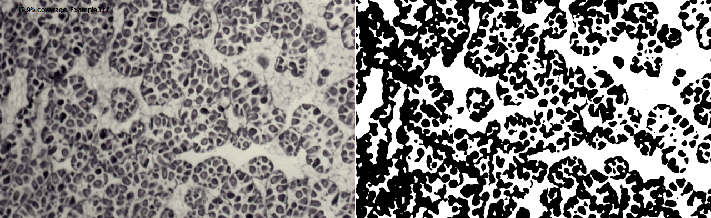
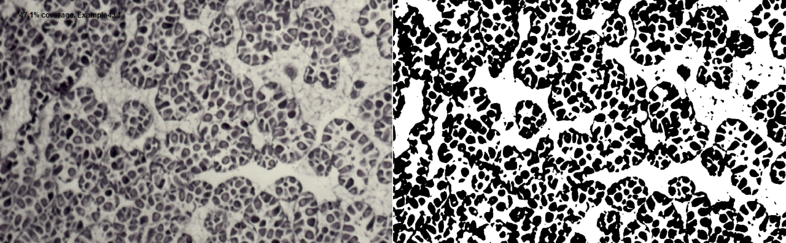
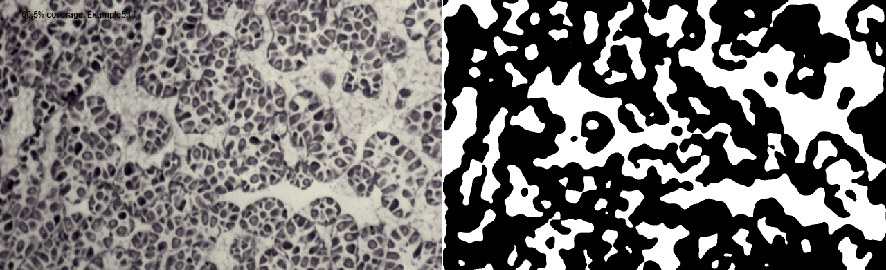
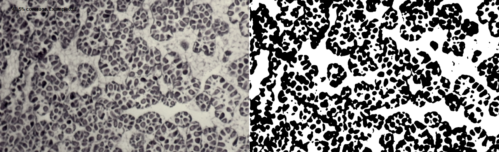
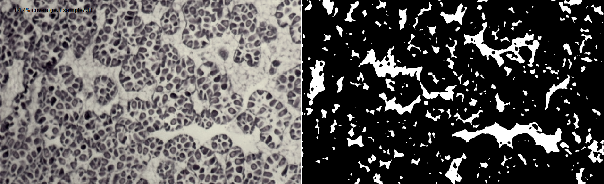

# **imExtractor**

[](https://zenodo.org/badge/latestdoi/72203215)


The goal of **imExtractor** is to provide a simple and flexible tool to analyze images as binary thresholds. imExtractor functions are wrappers which integrate processing steps of [EBImage](https://bioconductor.org/packages/release/bioc/html/EBImage.html) and as such are not compiled as a stand alone package. However functions can be directly soured into the R workspace with instructions [_here_](#installation). Example application of this code is [available](#exampleuse) and is based on an image of blue mussel (_mytilus edulis_) gonad stored within the [vignettes](github.com/rystanley/imextractor/vignettes) folder.

***


*Example output from image processing where image cellular tissue is quantified relative to the cropped image. In this case the tissue coverage was assigned at 50.3% of the original image.*

***
**Requirement:**
imExtractor requires the installation and availability of the R package 'EBImage' which is available at [biocondicutor](https://bioconductor.org/packages/release/bioc/html/EBImage.html) with example use [instructions](https://www.bioconductor.org/packages/devel/bioc/vignettes/EBImage/inst/doc/EBImage-introduction.html) 

***

## Contributions:
*imExtractor* coded by Ryan Stanley <https://github.com/rystanley> 

* If you don’t understand something, please let me know: 
(ryan.stanley _at_ dfo-mpo.gc.ca). 
* Any ideas on how to improve the functionality are very much appreciated. 
* If you spot a typo, feel free to edit and send a pull request.

Pull request how-to: 

  * Click the edit this page on the sidebar.
  * Make the changes using github’s in-page editor and save.
  * Submit a pull request and include a brief description of your changes. (e.g. "_spelling errors_" or "_indexing error_").
  
***

# **Citation** 

A Zenodo DOI is also avaiable for the most recent release of **imExtractor**:

[](https://zenodo.org/badge/latestdoi/72203215)

Stanley, R.R.E. (2017). imExtractor: a simple and flexible tool to analyze images as binary thresholds. DOI:10.5281/zenodo.802877


***
# **Installation**

*imExtractor* can be sourced into the workspace by cloning this [Github directory](github.com/rystanley/imextractor) or by sourcing directly using the web url.

<a name="installation"/>

```r
library(RCurl) # if you do not have the package rcurl installed please load from CRAN.
library(EBImage) # see installation instructions for the EBImage package.

#links for the 'raw' code
Weblinks <- c("https://raw.githubusercontent.com/rystanley/imExtractor/master/Code/ImageBatchProcess.R",
              "https://raw.githubusercontent.com/rystanley/imExtractor/master/Code/ImageProcess_Singular.R")

#source the 'raw' code links into the local environment
for (i in Weblinks){
  
  script <- getURL(i, ssl.verifypeer = FALSE)
  eval(parse(text = script),envir=.GlobalEnv)
  rm(script)  
}

```

# **Example use** <a name="exampleuse"/>

**NOTE** this code will create a folder called "Processed images" and store a visual representation of the processed output in '.png' format. 
This image processing script uses approaches and parameters to augment the processing:

**Approach** | **Description**  
--------------|-----------------------------------
*Adaptive thresholding* | is a technique to account for variation in illumination and cell tissue transparency or binary target colour within each image.
*Gaussian blurring* | is a low-pass filter which effectively blurs the image.
*Bottom cropping* | this is an optional parameter enabling the code to automatically crop the bottom of the image off according to a set number of pixels. This parameter is useful if images have a scale bar added to each. 


**Parameter** | **Input**  
--------------|-----------------------------------
*path* | the full or relative file path for the target image.
*pix* | Defines the number of pixels to be used in adaptive thresholding (default: 200). Here a threshold is applied by a locally moving filter. 
*offset*| Thresholding offset from the averaged pixel value (default: 0.01). In this case each group of pixels an average will be used to define what is 'target' (e.g. tissue) and what is 'background' this offset will define how far off the average you want to make this delineation. 
*sigma* | This parameter repesentes the standard deviation of the Gaussian filter used for blurring (default: 3). 
*crop* | Optional bottom cropping parameter (default: no cropping or NA).

##Process single images:

Run image processing script to a single image using default parameters. 

```r
setwd("vignettes/")
ImageProcess_single("Example1.tif") # default parameters

```


**Example output from image processing where image cellular tissue is quantified relative to the cropped image. In this case the tissue coverage was assigned at 50.3% of the original image.**

***

Run image processing script to a single image using a smaller (50 px) and larger (500 px) adaptive thresholding window and otherwise default parameters. 

```r
setwd("vignettes/")
ImageProcess_single("Example2.tif",pix=50) # default parameters
ImageProcess_single("Example3.tif",pix=400) # default parameters

```



**Example output from image processing with thresholding window adjusted to 50 pixels (tissue coverage = 47.6%).**



**Example output from image processing with thresholding window adjusted to 400 pixels (tissue coverage = 49.9%).**

***

Run image processing script to a single image using decreased and increased blurring otherwise default parameters. 

```r
setwd("vignettes/")
ImageProcess_single("Example4.tif",sigma=0.01) # default parameters
ImageProcess_single("Example5.tif",sigma=10) # default parameters

```



**Example output from image processing with a decreased standard deviation of the Gaussian blurring filter (tissue coverage = 47.1%).**



**Example output from image processing with an increased standard deviation of the Gaussian blurring filter (tissue coverage = 60.5%).**

***
Run image processing script to a single image using decreased and increased thresholding offsets. 

```r
setwd("vignettes/")
ImageProcess_single("Example6.tif",offset=0.001) # default parameters
ImageProcess_single("Example7.tif",offset=0.175) # default parameters

```


**Example output from image processing with a decreased thresholding offset (tissue coverage = 48.5%).**



**Example output from image processing with an increased standard deviation of the Gaussian blurring filter (tissue coverage = 84.4%).**

##Batch process images:

```r
#Batch process all images in the image in the directory. This function applies the ImageProcess_Singular to each image (.tif) in path specified by the folder parameter.

BatchProcessExample <-ImageBatchProcess(folder="Batch/") # default parameters. 

BatchProcessExample # view output

```
